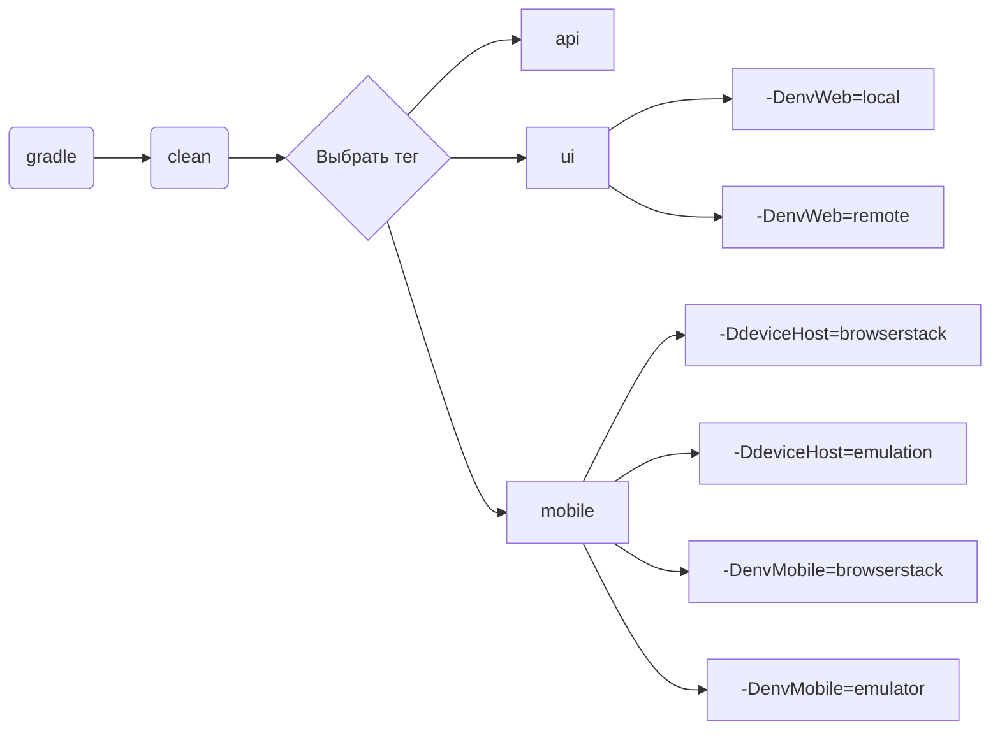
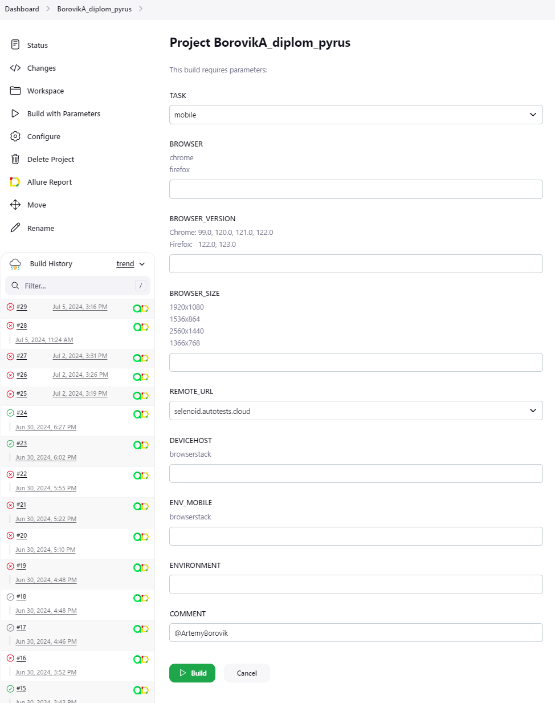
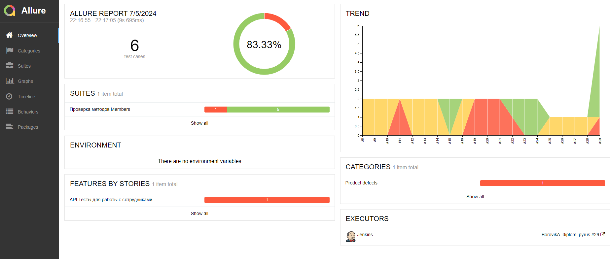
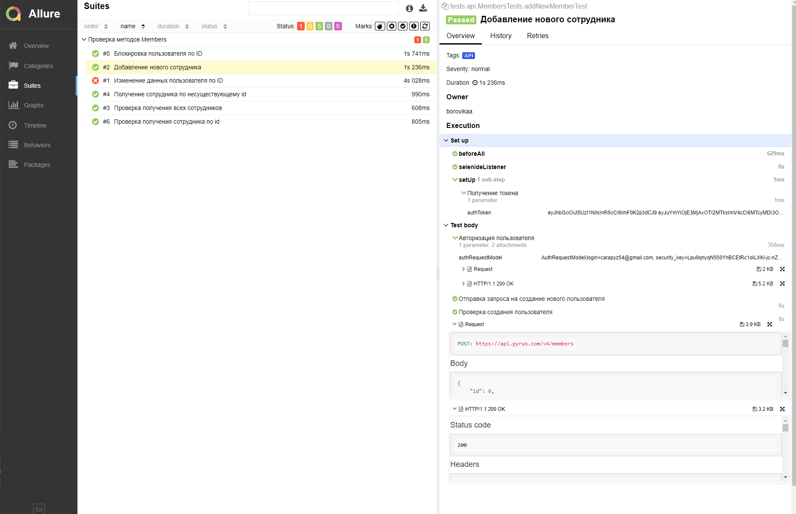
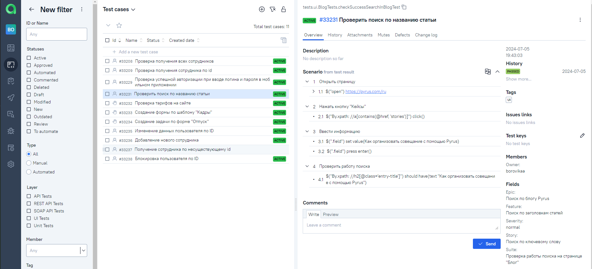
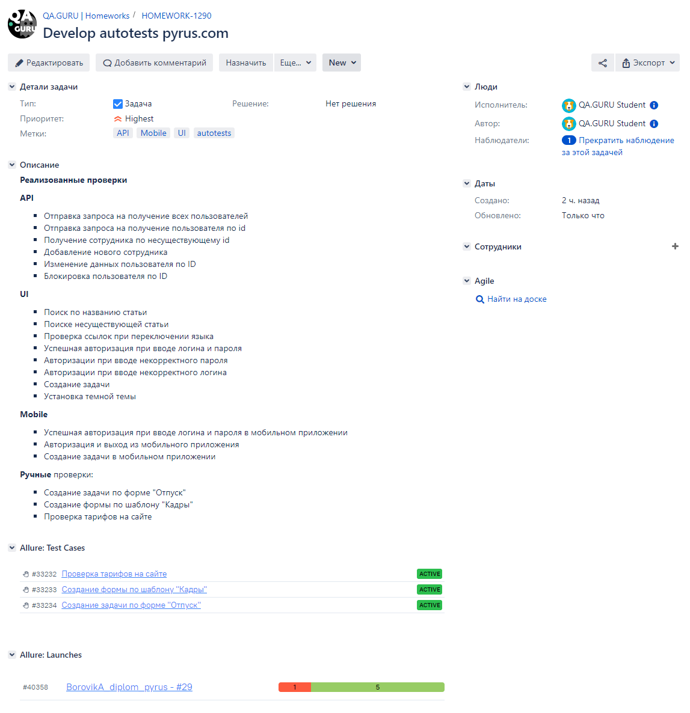
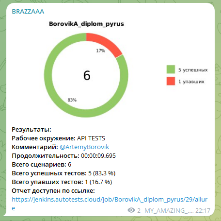
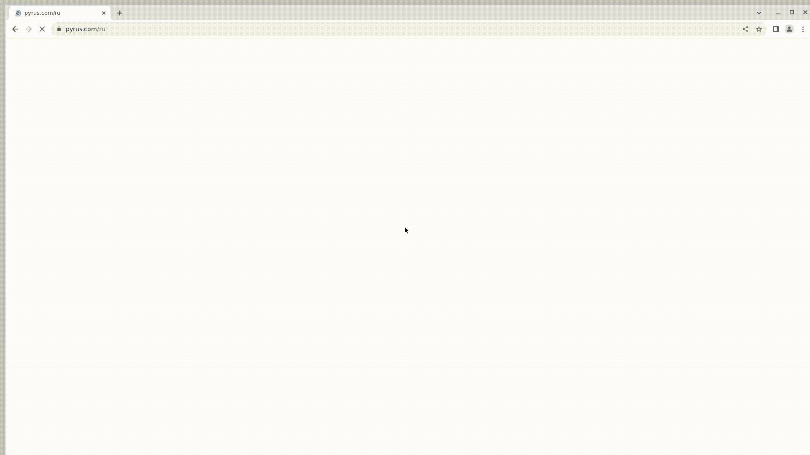

# Дипломный проект автоматизации тестирования

<html>
 <body> 
   <p><a href="https://pyrus.com/ru"></a></p>
 </body> 
</html>

## Содержание

* <a href="#description">Описание</a>
+ [Технологии и инструменты](#Технологии-и-инструменты)
+ [Реализованные проверки](#Реализованные-проверки)
+ [Запуск тестов](#)
    + [Допустимые комбинации](#Допустимые-комбинации)
    + [Локальный запуск тестов](#Локальный-запуск-тестов)
    + [Удаленный запуск тестов](#Удаленный-запуск-тестов)
+ [Cборка тестов в Jenkins](#jenkins)
+ [Интеграция с Allure Report](#allure)
    + [Диаграммы прохождения тестов](#Диаграммы-прохождения-тестов)
    + [Развернутый результат прохождения тестов](#Развернутый-результат-прохождения-тестов)
+ [Интеграция с Allure TestOps](#allure-testops)
+ [Интеграция с Jira](#jira)
+ [Уведомления в Telegram с использованием бота](#telegram)
+ [Пример выполнения теста в Selenoid](#video)

<a id="description"></a>
## Описание

Pyrus — это система для автоматизации рабочих процессов, бизнес-коммуникаций, управления задачами и согласования
документов. Pyrus является SaaS-приложением и представляет собой единую корпоративную коммуникационную среду, доступную
с любого устройства.

**Особенности проекта**:

- `Page Object` шаблон проектирования
- Использование техноголии `Owner` для придания тестам гибкости и легкости конфигурации
- Возможность запуска тестов: локально, удалённо, по тегам
- Использование `Faker` для генерации данных
- Использование `Lombok` для моделей в API тестах
- Использование собственных расширений:
    - `@Authorization` для предварительной авторизации
    - `@AuthToken` для получения токена
- Возможность запуска тестов напрямую из Allure TestOps
- Интеграция с Jira
- Уведомление о результатах прохождения в Telegram
- По итогу прохождения автотестов генерируется Allure отчет. Содержание отчета:
    - Шаги теста
    - Скриншот страницы на последнем шаге
    - Исходный код страницы в браузере
    - Логи консоли браузера
    - Видео выполнения автотеста

## Технологии и инструменты

<div align="center">
<a href="https://www.jetbrains.com/idea/"></a>
<a href="https://github.com/"></a>  
<a href="https://www.java.com/"></a>
<a href="https://gradle.org/"></a>  
<a href="https://junit.org/junit5/"></a>
<a href="https://selenide.org/"></a>
<a href="https://aerokube.com/selenoid/"></a>
<a href="https://rest-assured.io/"></a>
<a href="https://www.browserstack.com/"></a>
<a href="https://appium.io/"></a>
<a href="https://developer.android.com/studio"></a>
<a href="https://www.jenkins.io/"></a>
<a href="https://github.com/allure-framework/"></a>
<a href="https://qameta.io/"></a>
<a href="https://www.atlassian.com/software/jira"></a>  
<a href="https://telegram.org/"></a>
</div>

## Реализованные проверки

### API

- [x] Отправка запроса на получение всех пользователей
- [x] Отправка запроса на получение пользователя по ID
- [x] Получение сотрудника по несуществующему ID
- [x] Добавление нового сотрудника
- [x] Изменение данных пользователя по ID
- [x] Блокировка пользователя по ID

### UI

- [x] Поиск по названию статьи
- [x] Поиске несуществующей статьи
- [x] Проверка ссылок при переключении языка
- [x] Успешная авторизация при вводе логина и пароля
- [x] Авторизации при вводе некорректного пароля
- [x] Авторизации при вводе некорректного логина
- [x] Создание задачи
- [x] Установка темной темы

### Mobile

- [x] Успешная авторизация при вводе логина и пароля
- [x] Проверка авторизации при вводе неверного пароля
- [x] Проверка авторизации при вводе неверного Email адреса

### Ручные проверки:

- [x] Создание задачи по форме "Отпуск"
- [x] Создание формы по шаблону "Кадры"
- [x] Проверка тарифов на сайте

## Запуски тестов

> [!NOTE]
> Убедитесь, что у вас установлены Java, Gradle, IntelliJ IDEA и в качестве браузера используется Chrome

Конфигурационные файлы `.properties` лежат в папке `resources`. <br/>
При необходимости можно изменить их.

### Допустимые комбинации



### Локальный запуск тестов

#### Запуск всех тестов

Для запуска следует открыть IntelliJ IDEA и выполнить в терминале:

```
gradle clean test
```

#### UI

```
gradle clean ui
```

#### API

```
gradle clean api 
```

#### Mobile

```
gradle clean mobile -DdeviceHost=${DEVICEHOST} -DenvMobile=${ENV_MOBILE}
```

Тесты можно запустить в в облачной
платформе <a target="_blank" href="https://www.browserstack.com/"> Browserstack </a>, для этого нужно указать:

<code>-DdeviceHost=browserstack</code>
<code>-DenvMobile=browserstack</code>

Так же тесты можно запустить в эмуляторе, созданном средствами Appium Server & Appium
Inspector. <br/> <a target="_blank" href="https://autotest.how/appium-setup-for-local-android-tutorial-md"> Инструкция
по
настройке </a>

Для запуска мобильных тестов нужно определить следующие значения deviceHost и envMobile:

<code>-DdeviceHost=emulation</code>
<code>-DenvMobile=emulator</code>

<details>
   <summary>Дополнительные команды:</summary>

1. Выполнить запрос на формирование отчета:

```
gradle allureReport
```

2. Открыть отчет в браузере:

```
gradle allureServe
```

</details>

### Удаленный запуск тестов

Тесты можно запустить из терминала IntelliJ IDEA, а выполнены они будут в удаленно запущенном браузере в
Docker-контейнере Selenoid:

```
gradle clean test -Denv=remote
```

Параметры, которыми можно управлять:

```
-Dbrowser - наименование браузера. По умолчанию chrome
-Dbrowser_version - номер версии браузера. По умолчанию 122.0
-Dbrowser_size - размер окна браузера. По умолчанию 1980x1080
-DbaseUrl - по умолчанию https://pyrus.com/
-Dremote_url - адрес удаленного сервера, на котором будут запускаться тесты
```

<a id="jenkins"></a>

## </a><a name="Сборка"></a>Сборка в [Jenkins](https://jenkins.autotests.cloud/job/BorovikA_diplom_pyrus/)</a>

### По результатам каждого запуска тестов в Jenkins создается Allure отчет с подробной информацией по каждому пройденному тесту.

<details>

Для запуска сборки необходимо перейти в раздел `Build with Parameters` и нажать кнопку `Build`.
Сборка с параметрами позволяет перед запуском задать нужные параметры для сборки:



</details>

<a id="allure"></a>

## </a> <a name="Allure"></a>Интеграция с [Allure Report](https://jenkins.autotests.cloud/job/BorovikA_diplom_pyrus/allure/)</a>

### По результатам каждого запуска тестов в Jenkins создается Allure отчет с подробной информацией по каждому пройденному тесту.

<details>

Диаграммы прохождения тестов

`ALLURE REPORT` - отображает дату и время теста, общее количество запущенных тестов, а также диаграмму с процентом и
количеством успешных, упавших и сломавшихся в процессе выполнения тестов <br/>
`TREND` - отображает тенденцию выполнения тестов для всех запусков <br/>
`SUITES` - отображает распределение тестов по сьютам <br/>
`CATEGORIES` - отображает распределение неудачных тестов по типам дефектов



#### Развернутый результат прохождения тестов:

1. Общий список автотестов
2. Содержание автотеста
3. Вложения 

</details>

<a id="allure-testops"></a>

## </a>Интеграция с <a target="_blank" href="https://allure.autotests.cloud/project/4316/">Allure TestOps</a>

### Полная статистика по прохождению тест-кейсов, отчёты и приложения к ним хранятся в Allure TestOps(запрос доступа admin@qa.guru).

<details>

Пример тест кейсов в Allure TestOps



</details>

<a id="jira"></a>

## </a> Интеграция с <a target="_blank" href="https://jira.autotests.cloud/browse/HOMEWORK-1290">Jira</a>

### Реализована интеграция Allure TestOps с Jira, в тикете отображается информация, какие тест-кейсы были написаны в рамках задачи и результат их прогона

<details>
В Jira создана задача HOMEWORK-1290

В разделе `Allure:Test Cases` отображаются интегрированные автоматизированные и ручные тесты


</details>

<a id="telegram"></a>

## </a> Уведомление в Telegram при помощи бота

### Бот, созданный в Telegram, после завершения сборки отправляет сообщение с отчетом о прохождении тестов

<details>

</details>

<a id="video"></a>

## </a>Видео запуска тестов в Selenoid
<details>

### К каждому UI-тесту в отчете прилагается видео

   

### К каждому мобильному тесту, выполняемому в Browserstack, к отчету прилагается видео

   

</details>