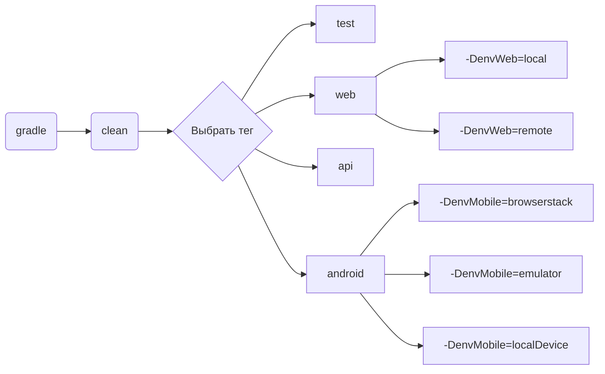

# Дипломныый проект автоматизации тестирования Pyrus

<html>
 <body> 
   <p><a href="https://pyrus.com/ru"></a></p>
 </body> 
</html>

## Содержание
+ [Описание](#Описание)
+ [Технологии и инструменты](#Технологии-и-инструменты)
+ [Реализованные проверки](#Реализованные-проверки)
+ [Запуск тестов](#)
    + [Допустимые комбинации](#Допустимые-комбинации)
    + [Локальный запуск тестов](#Локальный-запуск-тестов)
    + [Удаленный запуск тестов](#Удаленный-запуск-тестов)
+ [Cборка тестов в Jenkins](#jenkins)
+ [Интеграция с Allure Report](#allure)
    + [Диаграммы прохождения тестов](#Диаграммы-прохождения-тестов)
    + [Развернутый результат прохождения тестов](#Развернутый-результат-прохождения-тестов)
+ [Интеграция с Allure TestOps](#allure-testops)
+ [Интеграция с Jira](#jira)
+ [Уведомления в Telegram с использованием бота](#telegram)
+ [Пример выполнения теста в Selenoid](#video)
  

## Описание
 Pyrus — это система для автоматизации рабочих процессов, бизнес-коммуникаций, управления задачами и согласования документов. Pyrus является SaaS-приложением и представляет собой единую корпоративную коммуникационную среду, доступную с любого устройства.

**Особенности проекта**:
- `Page Object` шаблон проектирования
- Использование техноголии `Owner` для придания тестам гибкости и легкости конфигурации
- Возможность запуска тестов: локально, удалённо, по тегам
- Использование `Faker` для генерации данных
- Использование `Lombok` для моделей в API тестах
- Использование собственных расширений:
    - `@Authorization` для предварительной авторизации
    - `@AuthToken` для получения токена
- Возможность запуска тестов напрямую из Allure TestOps
- Интеграция с Jira
- Уведомление о результатах прохождения в Telegram
- По итогу прохождения автотестов генерируется Allure отчет. Содержание отчета:
    - Шаги теста
    - Скриншот страницы на последнем шаге
    - Исходный код страницы в браузере
    - Логи консоли браузера
    - Видео выполнения автотеста

## Технологии и инструменты

<div align="center">
<a href="https://www.jetbrains.com/idea/"></a>
<a href="https://github.com/"></a>  
<a href="https://www.java.com/"></a>
<a href="https://gradle.org/"></a>  
<a href="https://junit.org/junit5/"></a>
<a href="https://selenide.org/"></a>
<a href="https://aerokube.com/selenoid/"></a>
<a href="https://rest-assured.io/"></a>
<a href="https://www.browserstack.com/"></a>
<a href="https://appium.io/"></a>
<a href="https://developer.android.com/studio"></a>
<a href="https://www.jenkins.io/"></a>
<a href="https://github.com/allure-framework/"></a>
<a href="https://qameta.io/"></a>
<a href="https://www.atlassian.com/software/jira"></a>  
<a href="https://telegram.org/"></a>
</div>

## Реализованные проверки
### UI
- [x] lorem ipsum dolor sit amet
- [x] lorem ipsum dolor sit amet
- [x] lorem ipsum dolor sit amet
- [x] lorem ipsum dolor sit amet
- [x] lorem ipsum dolor sit amet
- [x] lorem ipsum dolor sit amet
- [x] lorem ipsum dolor sit amet
- [x] lorem ipsum dolor sit amet

### Api
- [x] lorem ipsum dolor sit amet
- [x] lorem ipsum dolor sit amet
- [x] lorem ipsum dolor sit amet
- [x] lorem ipsum dolor sit amet
- [x] lorem ipsum dolor sit amet

### Mobile
- [x] lorem ipsum dolor sit amet
- [x] lorem ipsum dolor sit amet
- [x] lorem ipsum dolor sit amet

### Ручные проверки:
- [x] lorem ipsum dolor sit amet
- [x] lorem ipsum dolor sit amet

## Запуски тестов НУЖНО ПЕРЕДЕЛАТЬ
> [!NOTE]
> Убедитесь, что у вас установлены Java, Gradle, IntelliJ IDEA и в качестве браузера используется Chrome
>

Конфигурационные файлы `.properties` лежат в папке `resources`. <br/>
При необходимости можно изменить их.

### Допустимые комбинации



### Локальный запуск тестов
#### Запуск всех тестов

Для запуска следует открыть IntelliJ IDEA и выполнить в терминале:
```
gradle clean test
```

или 

```
gradle clean test -Denv=local
```

#### WEB

```
gradle clean web
```


#### API
```
gradle clean api 
```

#### Mobile

```
gradle clean android -DenvMobile=${ENV_MOBILE}
```
Для запуска мобильных тестов нужно определить значение envMobile:
- <code>-DenvMobile=browserstack</code> : тесты будут запущены в облачной платформе <a target="_blank" href="https://www.browserstack.com/"> Browserstack </a> 
- <code>-DenvMobile=emulator</code> : тесты будут запущены в эмуляторе, созданном средствами Appium Server & Appium Inspector. <br/> <a target="_blank" href="https://autotest.how/appium-setup-for-local-android-tutorial"> Инструкция по настройке </a> 
- <code>-DenvMobile=localDevice</code> : тесты будут запущены на устройстве, подключенному по usb. <br/> Так же требуется настройка Appium Server & Appium Inspector

<details>
   <summary>Дополнительные команды:</summary>
  
1. Выполнить запрос на формирование отчета:
```
gradle allureReport
```
2. Открыть отчет в браузере:
```
gradle allureServe
```

</details>

### Удаленный запуск тестов
Тесты можно запустить из терминала IntelliJ IDEA, а выполнены они будут в удаленно запущенном браузере в Docker-контейнере Selenoid:

```
gradle clean test -Denv=remote
```

Параметры, которыми можно управлять:
```
-DbrowserName - наименование браузера. По умолчанию chrome
-DbrowserVersion - номер версии браузера. По умолчанию 100.0
-DbrowserSize - размер окна браузера. По умолчанию 1980x1080
-DremoteUrl - адрес удаленного сервера, на котором будут запускаться тесты
```
<a id="jenkins"></a>
## </a><a name="Сборка"></a>Сборка в [Jenkins](https://jenkins.autotests.cloud/job/BorovikA_diplom_pyrus/)</a>


>Для запуска сборки необходимо перейти в раздел `Build with Parameters` и нажать кнопку `Build`


> Сборка с параметрами позволяет перед запуском задать нужные параметры для сборки:

<p align="center">

</p>


<a id="allure"></a>
## </a> <a name="Allure"></a>Интеграция с [Allure Report](https://jenkins.autotests.cloud/job/BorovikA_diplom_pyrus/allure/)</a>


#### Диаграммы прохождения тестов
`ALLURE REPORT` - отображает дату и время теста, общее количество запущенных тестов, а также диаграмму с процентом и количеством успешных, упавших и сломавшихся в процессе выполнения тестов <br/>
`TREND` - отображает тенденцию выполнения тестов для всех запусков <br/>
`SUITES` - отображает распределение тестов по сьютам <br/>
`CATEGORIES` - отображает распределение неудачных тестов по типам дефектов


#### Развернутый результат прохождения тестов:
1. Общий список автотестов
2. Содержание автотеста
3. Вложения


<a id="allure-testops"></a>
## </a>Интеграция с <a target="_blank" href="https://allure.autotests.cloud/project/">Allure TestOps</a>

### Полная статистика по прохождению тест-кейсов, отчёты и приложения к ним хранятся в Allure TestOps(запрос доступа admin@qa.guru).

>Диаграммы прохождения тестов
>


<a id="jira"></a>
## </a> Интеграция с <a target="_blank" href="https://jira.autotests.cloud/browse/">Jira</a>

>В Jira создана задача
>


>В разделе `Allure:Test Cases` отображаются интегрированные автоматизированные и ручные тесты


<a id="telegram"></a>
## </a> Уведомление в Telegram при помощи бота

> Бот, созданный в Telegram, после завершения сборки отправляет сообщение с отчетом о прохождении тестов
> 


<a id="video"></a>
## </a>Видео запуска тестов в Selenoid

> К каждому UI-тесту в отчете прилагается видео
<p align="center">
  
</p>

> К каждому мобильному тесту, выполняемому в Browserstack, к отчету прилагается видео
<p align="center">
  
</p>
